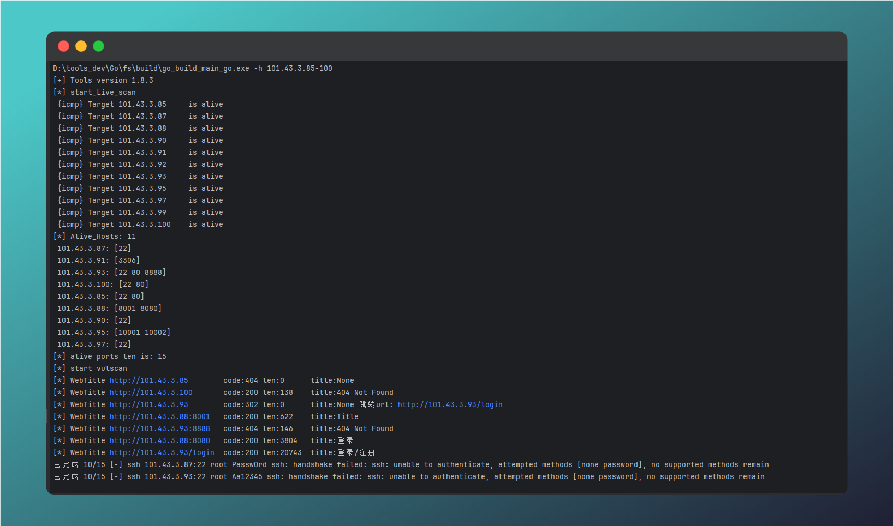

# fs


---

你可以将此分支看作fscan的活跃实验分支，区别就是结合个人需求和代码习惯，开发命名习惯不同修改太多，功能成熟到时候精简代码向fscan提pr。

当前修改包括

* 优化存活主机输出顺序 - 按顺序输出

* 优化端口探测结果输出 - 如下图
* 修改输出文件名 - r.txt
* 部分功能删除 - 例如JSON格式输出等
* 其他逻辑修改等等

注：fscan 1.8.4的releases在win7等平台运行报错

go 从 1.21版本放弃了对Windows 全平台的支持，，编译go版本建议使用go 1.20

参考：[Go 1.20 Release Notes - The Go Programming Language](https://go.dev/doc/go1.20#windows)

tips: 360不杀 火绒fscan特征消除（代码里藏有免杀的密码）

开发笔记： [内网扫描工具 - Fscan的功能优化和代码实现 (qq.com)](https://mp.weixin.qq.com/s?__biz=MzkwNjY0MzIyNw==&mid=2247483685&idx=1&sn=cccbf7b07d4b66153c9805d1d52c6273&chksm=c0e41351f7939a47bb974765cb3a8425a0eebef62f37990e11e370839a51ac2c03e56be843bb&token=1569401985&lang=zh_CN#rd)


##  使用演示

其他大致使用方法和fscan差不多

```
fs -h 101.43.3.85-100
```




